<div align="center">

</div>

<br>

```
$ ./init_akhileshwar.sh

[ 0.001 ] loading kernel .......................... ROS 2 (Jazzy)
[ 0.014 ] mounting simulation env ................. Gazebo · RViz
[ 0.031 ] initializing planner .................... MoveIt 2
[ 0.052 ] calibrating vision ...................... OpenCV
[ 0.077 ] flashing firmware ....................... Arduino · ESP32 · STM32
[ 0.098 ] loading policy .......................... ACT / VLA imitation learning
[ 0.114 ] role .................................... Electronics Engineering Student, EEE — RGIPT
[ 0.130 ] appointment ............................. Secretary, Robotics & Automation Society, IEEE RGIPT
[ 0.145 ] prior deployments ....................... Altersage Innovations Pvt. Ltd., Kozhikode · Bharat Electronics Ltd, Pune.
[ 0.161 ] status .................................. READY

akhileshwar@rgipt:~$ _
```

<br>

## Sub Systems — Active builds

| Unit | Status | Description | Stack |
|---|---|---|---|
| `master-slave-arm` | `● ONLINE` | 5-channel teleoperated arm — potentiometer master mirrors servo slave in real time. Exponential smoothing + piecewise calibration around each joint's home position. | `Arduino Mega` `C++` |
| `cocobot` | `● ONLINE` | Coconut-harvesting robotic arm running full ROS 2 Jazzy stack on a Jetson Orin Nano. | `ROS 2` `Jetson Orin Nano` |
| `campus-bot` | `◐ SIMULATED` | Autonomous campus delivery robot — Nav2 + SLAM for localization and path planning. | `ROS 2` `Nav2` `SLAM` |
| `warehouse-bot` | `◐ SIMULATED` | AMR for autonomous warehouse inventory navigation, packaged as a standalone ROS 2 node. | `ROS 2` `AMR` |
| `aruco-stem-arm` | `◐ SIMULATED` | Gazebo arm workspace detecting ArUco markers + green stems, aligning the end effector for pick sequences. | `Gazebo` `OpenCV` `ArUco` |
| `arm-box-pipeline` | `◐ SIMULATED` | Depth-camera box detection → end-effector approach → pruner-based cutting, planned with MoveIt 2, triggered via GUI. | `MoveIt 2` `depth camera` |
| `cyberwave-build` | `● ONLINE` | Pick-and-place robot powered by SmolVLA — built at a Physical AI hackathon. | `SmolVLA` `VLA` |
| `closed-loop-mech` | `◐ SIMULATED` | URDF / ROS 2 simulation of a closed-loop prismatic-triangular robotic mechanism. | `URDF` `ROS 2` |

<sub>`● ONLINE` — deployed on physical hardware &nbsp;·&nbsp; `◐ SIMULATED` — running in Gazebo / simulation</sub>

<br>

## Loaded Modules

```
perception    │ OpenCV · ArUco detection · depth cameras
planning      │ MoveIt 2 · Nav2 · SLAM
simulation    │ Gazebo · RViz · URDF
control       │ ROS 2 (Jazzy) · piecewise servo calibration · exponential smoothing
hardware      │ Arduino Mega · ESP32 · STM32 · Jetson Orin Nano
learning      │ ACT · VLA (SmolVLA) — imitation learning for manipulation
languages     │ Python · C++
```

## Transmission Ports

| port | address |
|---|---|
| `01 · github` | [github.com/akhileshwar-p-s](https://github.com/akhileshwar-p-s) |
| `02 · linkedin` | [linkedin.com/in/akhileshwar-p-s](https://www.linkedin.com/in/akhileshwar-p-s) |

<div align="center">
<sub>end of transmission _</sub>
</div>
